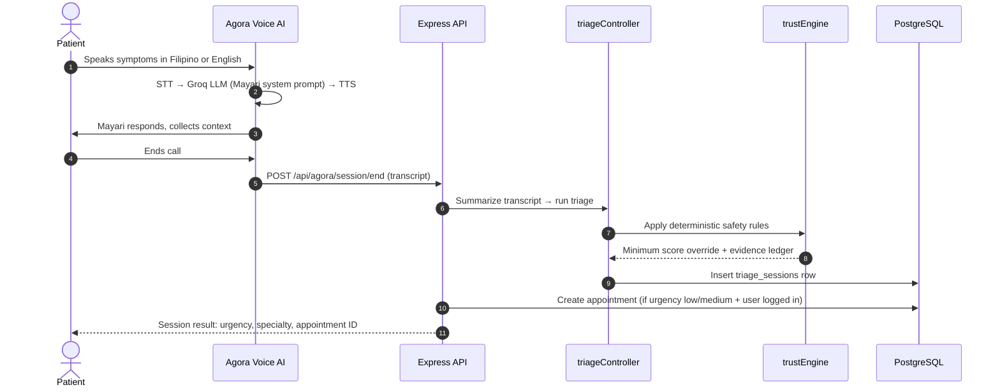

<div align="center">
  

# MAYARI

**AI voice patient intake and booking agent for Philippine medical clinics.**

*Sumasagot kung hindi kaya ng clinic mo.*


</div>

---

## Overview

**Mayari** is a real-time AI voice patient intake and booking agent for Philippine medical clinics.

Patients speak to Mayari in Filipino or English. Mayari collects their symptoms, assesses urgency, routes to the right specialty, and books an appointment — all through voice, without involving clinic staff for basic intake.

**Problem:** Philippine clinics are overloaded. Patients call in, staff manually collect symptoms, urgency is misjudged, queues are mismanaged, and critical cases wait alongside minor ones.

**Solution:** Mayari handles the intake call. It speaks naturally in Taglish, triages in real-time using Groq's LLM, applies deterministic safety rules for high-risk symptom patterns, and routes the patient to the right doctor's slot — automatically.

---

## Tech Stack

| Layer | Technology | Purpose |
|-------|-----------|---------|
| Frontend | Next.js (App Router) + TypeScript | Server-side rendering, routing, UI |
| Styling | Tailwind CSS + shadcn/ui | Component styling |
| State | Zustand + React Context | Voice session, auth, language, theme |
| Backend | Express.js + Drizzle ORM | API, business logic |
| Database | PostgreSQL (Neon) | Session storage, appointments, facilities |
| AI Inference | Groq (Llama-3.3-70b) | LLM for triage and voice agent |
| Voice | Agora Conversational AI | Real-time STT → LLM → TTS pipeline |
| TTS | Azure Cognitive Services | Filipino-accent English voice (RosaNeural) |
| Safety Layer | trustEngine (deterministic rules) | Urgency override for high-risk patterns |

---

## System Flow



---

## Repository Structure

```
mayari/
├── backend/                     # Express + Drizzle API
│   ├── configs/
│   ├── controllers/
│   │   ├── triageController.ts  # AI triage engine (DO NOT MODIFY)
│   │   └── healthIntelligenceController.ts
│   ├── models/
│   │   └── voiceSessionModel.ts
│   ├── routes/
│   │   ├── agoraRoutes.ts       # Voice session: start / end
│   │   └── haliyaRoutes.ts      # Triage + public health API
│   ├── services/
│   │   └── trustEngine.ts       # Deterministic safety rules (DO NOT MODIFY)
│   ├── views/
│   │   └── index.html
│   └── app.ts
├── frontend/                    # Next.js application
│   ├── public/img/
│   └── src/
│       ├── app/
│       ├── components/
│       │   └── VoiceSession.tsx  # Agora voice widget
│       ├── contexts/
│       ├── lib/
│       └── stores/
│           └── voiceSessionStore.ts
├── packages/
│   └── db/
│       └── schema.prisma        # Source of truth for schema
├── docs/
│   ├── LOCAL_RUNTIME.md
│   ├── MAYARI_SYSTEM_FLOW.md
│   ├── FEATURES.md
│   └── PITCH.md
└── README.md
```

---

## Core Features

### Voice Intake (Mayari Agent)
- Real-time voice conversation via Agora Conversational AI
- Bilingual ASR: Filipino (`fil-PH`) + English
- Azure TTS: `en-PH-RosaNeural` (Philippine English voice)
- Urgency routing: HIGH → ER redirect, MEDIUM → book, LOW → self-care advice
- Specialty routing: GP, Pediatrics, Internal Medicine, OB-GYN
- Post-call triage run using full transcript, deterministic safety rules applied

### AI Triage Engine
- Anonymous symptom checker via form or voice
- Groq-powered urgency scoring (1–10 scale)
- Deterministic safety rule layer that overrides AI for emergency patterns
- Evidence ledger with audit ID, triggered rules, confidence, and sources
- Longitudinal session history for pattern detection
- Facility recommendations based on urgency, region, and queue load

### Patient Dashboard
- Appointment management (pending, confirmed, cancelled)
- AI health summary from triage history
- Booking flow with triage pre-assessment

### Provider Dashboard
- Risk-prioritized appointment queue
- Clinician feedback submission
- Agreement rate and confusion matrix for AI validation

### Public Health Intelligence
- Regional symptom trend tracking
- Statistical anomaly engine (48h vs 14-day baseline)
- AI-generated outbreak alerts for LGU/facility teams

---

## Getting Started

### Prerequisites

- Node.js 18.x or later
- npm 9.x or later
- PostgreSQL database (Neon Postgres recommended)
- Groq API key
- Agora App ID, Certificate, Customer Key, and Customer Secret
- Azure Cognitive Services key and region (for TTS)

### Installation

```bash
git clone <repository-url>
cd mayari
npm install
```

Copy and fill the environment file:

```bash
cp .env.example .env
```

Run database migrations:

```bash
npm run db:migrate
```

Start backend and frontend together:

```bash
npm run dev
```

Frontend: `http://localhost:5173`
Backend API: `http://localhost:3000/api`

---

## Environment Variables

| Variable | Required | Description |
|----------|----------|-------------|
| `GROQ_API_KEY` | Yes | Groq API key for AI triage and voice LLM |
| `GROQ_MODEL` | Yes | Groq model, e.g. `llama-3.3-70b-versatile` |
| `DATABASE_URL` | Yes | PostgreSQL connection string |
| `WEB_ORIGINS` | Yes | Allowed frontend origins for CORS |
| `ACCESS_TOKEN_SECRET` | Yes | Secret for signing access tokens |
| `REFRESH_TOKEN_SECRET` | Yes | Secret for signing refresh tokens |
| `PORT` | Yes | Backend port, default `3000` |
| `AGORA_APP_ID` | Yes | Agora project App ID |
| `AGORA_APP_CERTIFICATE` | Yes | Agora App Certificate for token generation |
| `AGORA_CUSTOMER_KEY` | Yes | Agora REST API customer key |
| `AGORA_CUSTOMER_SECRET` | Yes | Agora REST API customer secret |
| `AZURE_TTS_KEY` | Yes | Azure Cognitive Services TTS key |
| `AZURE_TTS_REGION` | Yes | Azure region, e.g. `southeastasia` |

---

## Available Scripts

| Command | Description |
|---------|-------------|
| `npm run dev` | Start backend and frontend together |
| `npm run dev:api` | Start only the Express backend |
| `npm run dev:web` | Start only the Next.js frontend |
| `npm run build` | Build backend and frontend |
| `npm run lint` | Run ESLint on frontend |
| `npm run db:migrate` | Run Drizzle database migrations |

---

## Demo Access

### Patient Flow
- Email: `patient@mayari.ph`
- Password: `patient123`

Suggested path:
1. `/triage` — use voice intake or symptom form
2. `/history` — view triage session history
3. `/auth/login` — log in as demo patient
4. `/dashboard/patient` — appointments, health summary, booking

### Provider Flow
- Email: `provider@mayari.ph`
- Password: `provider123`

Suggested path:
1. `/facility/login` — log in as demo facility
2. `/dashboard/facility` — live queue, risk scores, feedback submission

### Public Health Flow
1. `/public-health` — regional signals, trend charts, anomaly alerts

---

## UI/UX Design

Mayari uses a calm, trust-centered health interface built around:

- **Teal primary palette** — care, trust, action
- **Risk color system** — teal (self-care) → amber (clinic) → red (emergency)
- **Mobile-first layout** — min-width 320px, no horizontal overflow
- **Bilingual-ready** — EN/FIL toggle in the shared header
- **Voice-forward** — voice session widget is the primary entry point on `/triage`

---

## Data Privacy

Mayari processes sensitive symptom information. The system is designed around:

- Anonymous triage: no account required for symptom checks
- Session tokens for longitudinal history, not personal identifiers
- Aggregated public-health outputs only — no patient identifiers in dashboards
- Deterministic safety rules as a non-AI override layer for auditability
- Account deletion removes profile, appointments, and device triage history

Mayari is a decision-support and care-navigation tool. It is not a doctor, diagnosis, or replacement for licensed clinical judgment. In an emergency, call 911 or go to the nearest ER.

---

## Local Readiness

- Health probe: `GET /api/health`
- Validation: `npm run build && npm run lint`
- All URLs are localhost only — no deployed URLs in code

---

## Delivery Phases

| Phase | Scope | Status |
|-------|-------|--------|
| Phase 1 — AI Triage | Symptom intake, urgency scoring, safety rules, evidence ledger | Complete |
| Phase 2 — Dashboards | Patient appointments, provider queue, clinician feedback | Complete |
| Phase 3 — Public Health | Regional analytics, anomaly detection, outbreak alerts | Complete |
| Phase 4 — Voice Intake | Agora voice agent, post-call triage, auto-booking | Complete |
